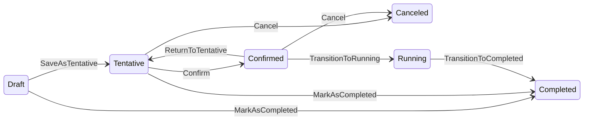

# Advanced Topics

This document covers advanced features of the `Skyline.DataMiner.Solutions.MediaOps.Plan` API: resource/pool and job state management, timing constraints, configuration state, orchestration settings and state, data references, eligible resources, Resource Studio ↔ SRM synchronization, logging, and installation checks.

## State Management

Resources and resource pools follow a lifecycle with three states: **Draft**, **Complete**, and **Deprecated**.

### Resource State Transitions


Resources are created in the **Draft** state. Once fully configured, they can be transitioned to **Complete** state to make them available for planning. A completed resource can be **Deprecated** when it is no longer needed, and restored back to **Complete** if required again.

```csharp
using Skyline.DataMiner.Solutions.MediaOps.Plan.API;
using Skyline.DataMiner.Solutions.MediaOps.Plan.Automation;

var api = engine.GetMediaOpsPlanApi();

// Create a resource (starts in Draft state)
var resource = api.Resources.Create(new UnmanagedResource
{
    Name = "Camera 1",
    Concurrency = 1,
});
// resource.State == ResourceState.Draft

// Transition to Complete
var completed = api.Resources.Complete(resource);
// completed[0].State == ResourceState.Complete

// Transition to Deprecated
var deprecated = api.Resources.Deprecate(resource);
// deprecated[0].State == ResourceState.Deprecated

// Restore from Deprecated back to Complete
var restored = api.Resources.Restore(resource);
// restored[0].State == ResourceState.Complete
```

### Batch State Transitions

State transitions can be performed on multiple resources at once:

```csharp
using Skyline.DataMiner.Solutions.MediaOps.Plan.API;
using Skyline.DataMiner.Solutions.MediaOps.Plan.Automation;

// Complete multiple resources
var completedResources = api.Resources.Complete(new[] { resource1, resource2, resource3 });

// Deprecate multiple resources
var deprecatedResources = api.Resources.Deprecate(new[] { resource1.Id, resource2.Id });

// Restore multiple resources
var restoredResources = api.Resources.Restore(new[] { resource1, resource2 });
```

### Resource Pool State Transitions

Resource pools follow the same lifecycle:

```csharp
using Skyline.DataMiner.Solutions.MediaOps.Plan.API;
using Skyline.DataMiner.Solutions.MediaOps.Plan.Automation;

// Complete a pool
var completed = api.ResourcePools.Complete(pool);

// Deprecate a pool
var deprecated = api.ResourcePools.Deprecate(pool);

// Deprecate with options
var deprecated = api.ResourcePools.Deprecate(pool, new ResourcePoolDeprecateOptions
{
    AllowResourceDeprecation = true, // Also deprecate resources in the pool
});

// Restore a pool
var restored = api.ResourcePools.Restore(pool);
```

## Job Lifecycle

Jobs go through a richer lifecycle than resources/pools, since a job also has a schedule and, once confirmed, a core reservation backing it.



- **`SaveAsTentative`** – Draft → Tentative.
- **`Confirm`** – Tentative → Confirmed. This is also where the underlying core reservation is created.
- **`ReturnToTentative`** – Confirmed → Tentative, to allow further edits before confirming again.
- **`Start`** (optionally with `JobStartOptions.NewStartTime`) – does not change `JobState` itself; it pulls a confirmed job's pre-roll start (and all node starts) forward to the current time so it begins immediately instead of waiting for its scheduled time. `TransitionToRunning` is still what moves it to `Running`, once its core reservation reports running.
- **`TransitionToRunning`** – Confirmed → Running. The job's pre-roll start time must have passed and its core reservation must already be running; use this once a job's reservation has actually started (whether that was triggered by `Start` or by reaching its scheduled pre-roll start on its own).
- **`Stop`** (optionally with `JobStopOptions.NewPostRollEnd`) – ends a running job early by moving its end to the current time; the job cannot already be in its pre-roll or post-roll window. Like `Start`, it does not change `JobState` by itself.
- **`TransitionToCompleted`** – Running → Completed, once the core reservation has ended (its status is authoritative even if the job's persisted post-roll end has not passed yet).
- **`Cancel`** – Tentative or Confirmed → Canceled.
- **`MarkAsCompleted`** – Draft or Tentative → Completed, for a job whose end time already lies in the past (for example, historical data import).
- **`Delete`** (with `JobDeleteOptions.ForceDelete`) – removes the job; `ForceDelete = true` bypasses the usual state restrictions on delete.

Every transition method has a single-job overload (`Job` or `Guid`) and a batch overload (`IEnumerable<Job>` or `IEnumerable<Guid>`) that returns the updated jobs. `RecurringJob` follows a simpler, independent lifecycle: **Active → Completed** (`RecurringJobs.Complete`) and **Active → Cancelled** (`RecurringJobs.Cancel`).

## Timing Constraints

A job's timing window (`PreRollStart <= Start <= End <= PostRollEnd`) is validated as a whole, and further constrained depending on the job's current state:

- **Draft / Tentative** – only the basic ordering rules apply, plus a minimum gap between adjacent boundaries (pre-roll start/start, start/end, end/post-roll end).
- **Confirmed** – a changed pre-roll start or start must still lie sufficiently far in the future; the job hasn't started yet, so it must remain possible to prepare for it.
- **Running** – any changed boundary (pre-roll start, start, end, post-roll end) must still lie in the future; a boundary that already occurred can no longer be changed.
- **Completed / Canceled** – no timing changes are accepted at all.

These checks surface as `MediaOpsException`/`MediaOpsBulkException<Guid>` with specific `MediaOpsErrorData` types (for example `JobInvalidPreRollError`, `JobStartChangeNotAllowedError`, `JobRunningInPreRollError`) whose `ErrorMessage` explains exactly which rule failed — inspect `MediaOpsException.TraceData.ErrorData` (or `MediaOpsBulkException<Guid>.Result`) rather than parsing the message text.

## Configuration State

`ConfigurationState` reports whether a job, recurring job, node, or set of orchestration settings has all the values it needs:

| Value | Meaning |
| --- | --- |
| `Unknown` | Not (yet) calculated. |
| `NoParametersDefined` | No capabilities/capacities/configurations/orchestration events are defined at all. |
| `MandatoryValuesMissing` | At least one mandatory capability, capacity or configuration has no value and no resolvable `Reference`. |
| `NonMandatoryValuesMissing` | All mandatory values are present, but at least one optional one is missing. |
| `AllValuesProvided` | Every defined value (mandatory and optional) is present or resolvable. |

Use `ConfigurationStateCalculator` to compute it on demand — it batches the lookup of the capability/capacity/configuration definitions and orchestration script requirements it needs, so a single instance should be reused across a batch of jobs or recurring jobs rather than constructed per job:

```csharp
using Skyline.DataMiner.Solutions.MediaOps.Plan.API;
using Skyline.DataMiner.Solutions.MediaOps.Live.API;
using Skyline.DataMiner.Solutions.MediaOps.Live.API.Extensions;

IConnection connection = /* create or retrieve connection */;
var planApi = connection.GetMediaOpsPlanApi();
var liveApi = connection.GetMediaOpsLiveApi(); // ConfigurationStateCalculator also needs the MediaOps Live API.

var calculator = new ConfigurationStateCalculator(planApi, liveApi, jobs); // or a single job / recurring job(s)

foreach (var job in jobs)
{
    var jobState = calculator.GetJobConfigurationState(job);
    bool jobMissingMandatory = calculator.HasMissingMandatoryValues(job);

    foreach (var node in job.NodeGraph.Nodes)
    {
        var nodeState = calculator.GetNodeConfigurationState(node);
    }
}

// Or calculate the state of a standalone set of orchestration settings (e.g. on a resource pool or workflow).
var settingsCalculator = ConfigurationStateCalculator.ForSettings(planApi, liveApi, pool.OrchestrationSettings);
var poolState = settingsCalculator.GetConfigurationState(pool.OrchestrationSettings);
```

`Job`, `RecurringJob` and `JobNode`/`RecurringJobNode` also expose the last-calculated value directly through their `ConfigurationState` property (populated when the job/recurring job is created or updated), and `JobExposers.ConfigurationState` / `JobExposers.Nodes.ConfigurationState` let you query on it.

> [!IMPORTANT]
> `ConfigurationState` replaces the `NodeConfigurationStatus`, `ResourceSelectionMode` and `ResourceSelectionState` types from 1.6.x, which have been removed. See [What's New Since 1.5](What%27s%20New%20Since%201.5.md#upgrading-from-16x-to-170-alpha) for the migration note.

## Data References and Reference Resolution

Capability, capacity and configuration settings (`CapabilitySetting`, `CapacitySetting`, `ConfigurationSetting`) can hold a `Reference` (a `DataReference`) instead of, or in addition to, a literal value. A reference lets a value be resolved dynamically instead of being hard-coded on the workflow/job — for example, take the value from a resource property, from a job property, or from the job's name:

```csharp
using Skyline.DataMiner.Solutions.MediaOps.Plan.API;

// Resolve from a job property instead of a fixed value.
job.OrchestrationSettings.AddCapability(new CapabilitySetting(capabilityId)
{
    Reference = new JobPropertyReference(jobPropertyId),
});

// Resolve from a resource property of the resource assigned to a specific node.
node.OrchestrationSettings.AddConfiguration(new TextConfigurationSetting(configurationId)
{
    Reference = new ResourcePropertyReference(resourcePropertyId, nodeId: node.Id),
});
```

Available reference types: `ResourceNameReference`, `ResourcePropertyReference`, `ResourceLinkedObjectIdReference`, `CapabilityParameterReference`, `CapacityParameterReference`, `ConfigurationParameterReference` (all node-scoped — they resolve relative to a specific node, defaulting to the node that owns the setting when `nodeId` is omitted), and `JobNameReference` / `JobPropertyReference` (job-scoped, not tied to a node).

References are resolved through a `ReferenceResolver` (or the job/workflow-specific `JobReferenceResolver` / `WorkflowReferenceResolver`). Resolution can fail in two ways, both surfaced as exceptions rather than silent defaults:

- **`UnresolvedReferenceException`** – the referenced value (property, node, ...) does not exist or has no value.
- **`CircularReferenceException`** – following the chain of references leads back to itself.

Job save/confirm flows validate references internally so that a job with broken references surfaces a clear error instead of silently orchestrating with a missing value. For custom tooling that needs to preview a resolved value, use `JobReferenceResolver` or `WorkflowReferenceResolver` and inspect the `ResolvedValue` returned by `ResolveValue(...)`.

## Resource Pool Options

### Delete Options

When deleting a resource pool, you can control what happens to its resources:

```csharp
using Skyline.DataMiner.Solutions.MediaOps.Plan.API;
using Skyline.DataMiner.Solutions.MediaOps.Plan.Automation;

api.ResourcePools.Delete(pool, new ResourcePoolDeleteOptions
{
    DeleteDraftResources = true,      // Delete resources in Draft state
    DeleteDeprecatedResources = true,  // Delete resources in Deprecated state
});
```

### Deprecate Options

```csharp
using Skyline.DataMiner.Solutions.MediaOps.Plan.API;
using Skyline.DataMiner.Solutions.MediaOps.Plan.Automation;

api.ResourcePools.Deprecate(pool, new ResourcePoolDeprecateOptions
{
    AllowResourceDeprecation = true, // Also deprecate resources assigned to this pool
});
```

## Orchestration Settings

Orchestration settings define automation behavior for resource pools and workflows. They contain capability, capacity, configuration, and orchestration event settings.

For a broader overview of orchestration concepts in MediaOps Live, see the official [Orchestration documentation](https://docs.dataminer.services/solutions/standard_solutions/MediaOps%20Live/Apps/MO_Orchestration_Events.html).

### Resource Pool Orchestration Settings

```csharp
using Skyline.DataMiner.Solutions.MediaOps.Plan.Automation;

var pool = api.ResourcePools.Read(poolId);

// Access orchestration settings
var orchestrationSettings = pool.OrchestrationSettings;

// Get configured capabilities
var capabilities = orchestrationSettings.Capabilities;

// Get configured capacities
var capacities = orchestrationSettings.Capacities;

// Get configured configurations
var configurations = orchestrationSettings.Configurations;

// Get orchestration events
var events = orchestrationSettings.OrchestrationEvents;
```

### Orchestration Events

Orchestration events define scripts that are executed at specific points during the orchestration lifecycle:

```csharp
using Skyline.DataMiner.Solutions.MediaOps.Plan.API;

// Available event types:
// - OrchestrationEventType.PrerollStart
// - OrchestrationEventType.PrerollStop
// - OrchestrationEventType.PostrollStart
// - OrchestrationEventType.PostrollStop
```

## Orchestration State

Orchestration events (`OrchestrationEventType.PrerollStart` / `PrerollStop` / `PostrollStart` / `PostrollStop`) are reported back onto the job as they execute, independently of the job's own lifecycle state (`JobState`). This lets custom automation confirm that a specific automation step actually ran, without having to infer it from timing alone:

```csharp
using Skyline.DataMiner.Solutions.MediaOps.Plan.API;
using Skyline.DataMiner.Solutions.MediaOps.Plan.Automation;

api.Jobs.SetOrchestrationState(jobId, new OrchestrationUpdateDetails
{
    Event = OrchestrationEventType.PrerollStart,
    EventState = OrchestrationEventState.Succeeded,
    Message = "Preroll completed successfully",
});

// Report a failure
api.Jobs.SetOrchestrationState(jobId, new OrchestrationUpdateDetails
{
    Event = OrchestrationEventType.PrerollStart,
    EventState = OrchestrationEventState.Failed,
    Message = "Preroll failed: device not reachable",
});
```

## Eligible Resources

`api.Resources.GetEligibleResources(EligibleResourcesContext)` finds resources that satisfy a set of capability/capacity requirements for a time range, together with how much of their capacity is already consumed:

- A resource is only returned if it has all the requested `CapabilitySettings` values and enough of each requested `CapacitySettings` amount left over for the whole time range.
- `EligibleResource.Usage.ConcurrencyConsumption` / `RemainingConcurrency` reflect how many concurrent reservations already overlap the requested time range, out of the resource's configured `Concurrency`.
- `EligibleResource.Usage.CapacityUsages` reports the same, per requested capacity: `NumberCapacityUsage` (current/remaining amount) or `RangeCapacityUsage` (current/remaining sub-ranges), depending on the capacity type.
- Usage is computed against every other overlapping reservation; there is no built-in way to exclude a specific job's own reservation, so when re-evaluating eligibility for an existing job node, expect that job's own current reservation to be counted like any other.
- `EligibleResourcesContext.Filter` narrows the candidate resources (for example, to a specific pool) *before* capability/capacity/availability are evaluated — it does not affect the usage calculation itself.

## Synchronization with SRM

Resource Studio (DOM) is the master for resource/resource pool configuration; SRM (Core) is a secondary system that mirrors it. Synchronization is deliberately a two-phase operation so nothing in SRM changes until you explicitly apply a selection:

1. **Detect** (`api.ResourcePools.GetOutOfSyncItems()` / `GetOutOfSyncItems(resourcePools)`) – compares every **completed** resource pool and completed resource against its SRM counterpart and returns a `SynchronizationReport`. Nothing is changed in SRM by this call.
   - `SynchronizationItem.Differences` lists what is different (a typed `SynchronizationDifference`, e.g. `NameDifference`, `CapacityDifference`, `MissingCoreObjectDifference`, ...); each difference only carries data, so you decide how (or whether) to present it.
   - `SynchronizationItem.CanSynchronize` is `false` when a **blocker** was found — a condition that prevents applying any change at all (for example, a duplicate name that would collide in SRM). `SynchronizationItem.Blockers` explains why, through `MediaOpsErrorData.ErrorMessage`.
2. **Apply** (`api.ResourcePools.Synchronize(items)`) – pushes the DOM configuration of the given items to SRM. Only pass items where `CanSynchronize` is `true`. Items are re-compared right before being applied, so a difference that disappeared in the meantime (because someone already fixed it) is simply skipped rather than reapplied. The returned `SynchronizationResult.Failures` reports, per item ID, why an item that could no longer be synchronized failed.

Only completed resources/pools participate; draft and deprecated objects are not compared or synchronized.

## Logging

The API supports custom logging through the `ILogger` interface.

### Setting a Logger

```csharp
using Skyline.DataMiner.Solutions.MediaOps.Plan.Automation;
using Skyline.DataMiner.Solutions.MediaOps.Plan.Logging;

var api = engine.GetMediaOpsPlanApi();

// Set a custom logger
api.SetLogger(myLogger);
```

## Installation and Setup

### Checking Installation Status

Verify that the MediaOps.PLAN application is installed:

```csharp
using Skyline.DataMiner.Solutions.MediaOps.Plan.Automation;

var api = engine.GetMediaOpsPlanApi();

if (!api.IsInstalled())
{
    // Application is not installed
}
```

### Getting the Installed Version

Retrieve the version of the installed application:

```csharp
using Skyline.DataMiner.Solutions.MediaOps.Plan.Automation;

var api = engine.GetMediaOpsPlanApi();

if (api.IsInstalled(out string version))
{
    Console.WriteLine($"MediaOps.PLAN Version: {version}");
}
```

## System Capabilities

The API provides access to built-in system capabilities:

```csharp
using Skyline.DataMiner.Solutions.MediaOps.Plan.Automation;

// Access the Resource Type system capability
var resourceType = api.Capabilities.SystemCapabilities.ResourceType;

// The Resource Type capability includes discrete values:
// "Element", "Pool Resource", "Service", "Unlinked Resource", "Virtual Function"
```

## Next Steps

- **[Quick Reference](Quick%20Reference.md)** – Common snippets for repositories, querying, and resource management
- **[Getting Started](Getting%20Started.md)** – Installation and basic usage
- **[What's New Since 1.5](What%27s%20New%20Since%201.5.md)** – What changed since 1.5.x, and what is still prerelease
